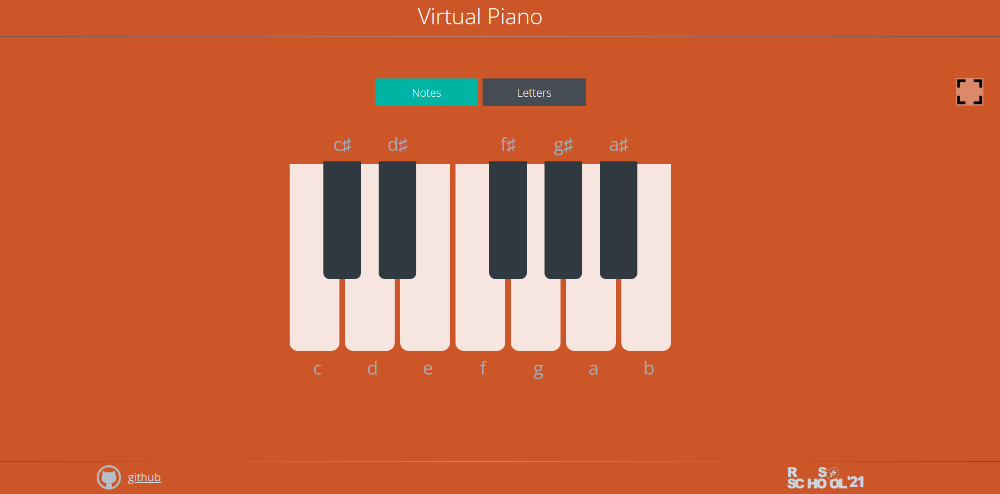

# 🎹 Virtual Piano

**Virtual Piano** — это веб-приложение, которое имитирует цифровое пианино прямо в браузере. Оно позволяет играть ноты как с помощью мыши, так и с клавиатуры. Поддерживается переключение отображения нот и букв на клавишах, а также полноэкранный режим для полного погружения в музыкальный процесс.

## 🔧 Технологии

- **HTML5** — разметка страницы
- **CSS3** — стилизация интерфейса
- **Vanilla JavaScript (ES6+)** — логика взаимодействия и воспроизведение звуков
- **Аудиофайлы (.mp3)** — реалистичные звуки нот

## 🚀 Возможности

- ✅ Игра на пианино при помощи **клавиатуры** или **мыши**
- ✅ Поддержка **зажатия клавиш** (без повторного воспроизведения)
- ✅ Переключение отображения:
  - **Ноты (C, D, E...)**
  - **Буквы клавиатуры (D, F, G...)**
- ✅ **Полноэкранный режим**
- ✅ Реалистичный интерфейс с белыми и чёрными клавишами
- ✅ Подсветка активных клавиш при нажатии или наведении
- ✅ Быстрая загрузка и воспроизведение аудио

## 🖥️ Использование

Просто откройте `index.html` в браузере и начните играть. Управление:

### 🧑‍💻 Клавиши

- Белые клавиши: D, F, G, H, J, K, L
- Чёрные клавиши: R, T, U, I, O

### 🖱️ Мышь

- Нажмите и удерживайте клавишу на экране.
- Проведите мышью по клавишам с зажатой кнопкой для игры гаммы.

## 📷 Скриншот

## 🔗 Ссылка

https://antonycoder.github.io/Virtual-piano/ 